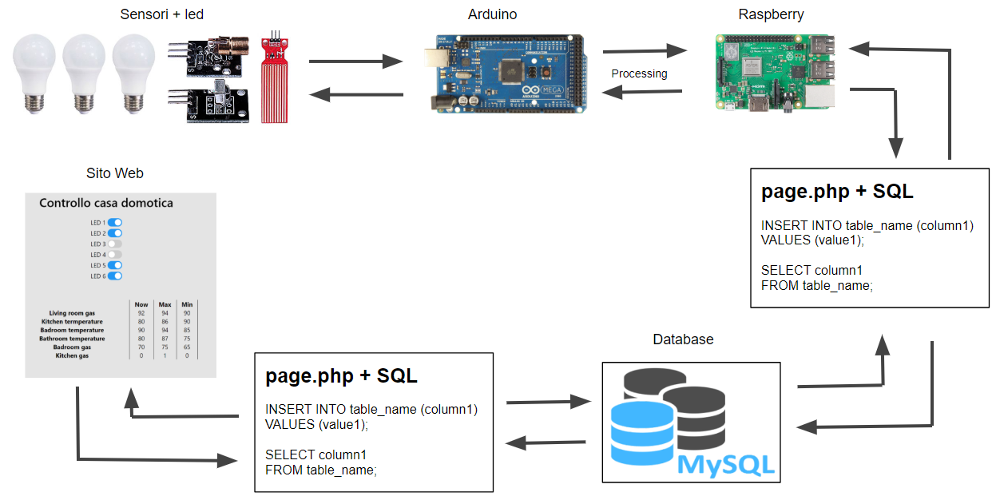
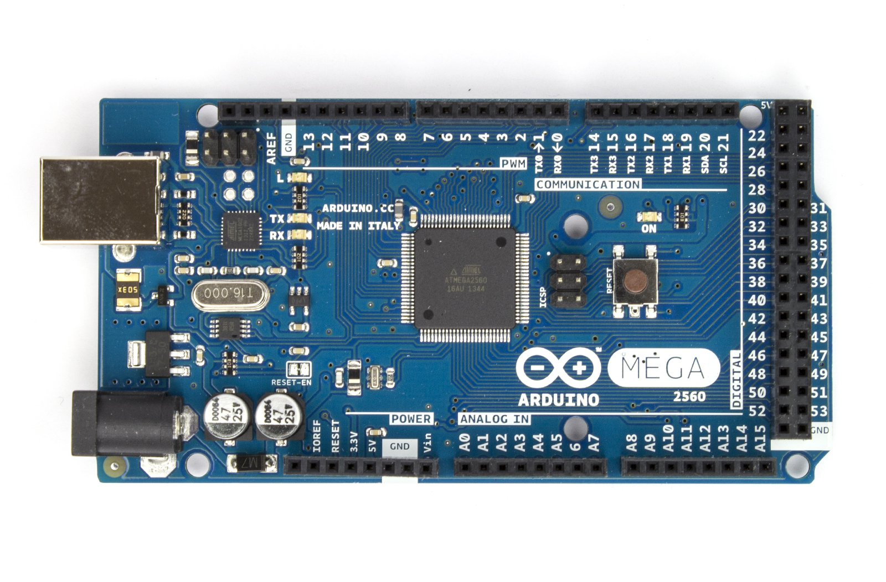
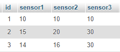
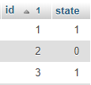

# Home automation
## Introduzione del progetto
Questo progetto, utilizza l'architettutra client-server per la gestione dei sistemi IOT da remoto tramite un sito web.

## Componenti utilizzati
Il progetto é incentrato sulla programmazione che porta la casa domotica a comunicare con il sito Web.  
La comunicazione avviene tramite 5 componenti:
- Sensori e led
- Arduino
- Raspberry
- Relational DataBase
- Sito Web



La comunicazione dei dati tra il sito web e i sensori è bidirezionale. I dati che sono inseriti all’interno del database sono richiesti sia dal sito web, sia da Raspberry che da Arduino.

## Setup
### Arduino



La programmazione di questo microcontrollore avviene tramite l'ambiente di sviluppo integrato: Arduino.  
Questa applicazione va a prendere i dati dei vari sensori connessi tramite i pin, e va a leggere se i led devono essere accesi o spenti, per poi aggiornarli.

``` Arduino
#include <dht11.h>

#define DHT11_PIN2 A1 // temperature sensor n1
#define DHT11_PIN1 A0 // temperature sensor n2
#define DHTTYPE DHT11
dht11 sensore;

char incoming;
int looppp = 8;

void setup() {
  Serial.begin(9600);

  pinMode(8, OUTPUT); // led n1
  pinMode(9, OUTPUT); // led n2
  pinMode(10, OUTPUT); // led n3
  pinMode(11, OUTPUT); // led n4
  pinMode(12, OUTPUT); // led n5
  pinMode(13, OUTPUT); // led n6
}

void loop() {
  //  led(8, 13); // firstPin, lastPin

  temperatureSensor(1); 
  // connection with pin A0
  // print humidity and temperature
  
  temperatureSensor(2); 
  // connection with pin A1
  // print humidity and temperature

  Serial.print(analogRead(A2)); 
  // print light sensor n1
  Serial.print("\t");
  
  Serial.print(analogRead(A3)); 
  // print light sensor n1
  Serial.print("\t");
  
  Serial.println(); 
  // print \n to close the string that will be sent 

  if (Serial.available()) {
    while (Serial.available() > 0) {
      incoming = Serial.read();

      if (incoming == '1') {
        digitalWrite(looppp, HIGH);
      } else {
        digitalWrite(looppp, LOW);
      }
      if (looppp == 13) {
        looppp = 8;
      } else {
        looppp = looppp + 1;
      }
    }
  }
  delay(1000);
}

void temperatureSensor(int nSensor) {
  if (nSensor == 1) {
    sensore.read(DHT11_PIN1); // read data
  } else if (nSensor == 2) {
    sensore.read(DHT11_PIN2); // read data
  } else {
    Serial.print("Error");
  }
  Serial.print(sensore.humidity, 1); 
  // print humidity
  Serial.print("\t");
  
  Serial.print(sensore.temperature, 1); 
  // print temperature
  Serial.print("\t");
}

```

## Raspberry

Per la comunicazione seriale con Arduino viene utilizzato Processing, un programma basato su Java. Il programma ha lo scopo di far comunicare Arduino al database. Il programma fa richiesta al database per richiedere quali led devono essere accesi, e passa questi dati all'Arduino, inoltre il programma fa la richiesta ad Arduino dei dati dei sensori per passarli al database.  
Il file scritto in processing è stato salvato in un file all’interno di Raspberry. Questo viene avviato all’accensione del Raspberry tramite uno script. Lo scipt è stato preso dalla [seguente pagina](https://raspberrypi.stackexchange.com/questions/8734/execute-script-on-start-up).

``` Processing
import processing.serial.*;
Serial port;
String input;

void setup()  {
  port = new Serial(this, Serial.list()[1], 9600); // windows
  // port = new Serial(this, Serial.list()[2], 9600); // raspbian
  delay(5000);
}

void draw() {
  if(port.available()>0){
    input = port.readStringUntil('\n');
  }
  if(input != null){
    input = trim(input);
    int dataSensors[];
    dataSensors = int(split(input,'\t'));
    Try{ 
// link to pass in POST the data
loadStrings("https://www.marcodifrancesco.com/tesina/insertData.php?data1="+dataSensors[0]+
"&data2="+dataSensors[1]+"&data3="+dataSensors[2]);
    } catch (Exception e) {
      System.out.println("Exception occurred");
    }
  }

  print(input+"\n");

  int out[] = new int[7];
  for(int led=1;led<=3;led++){
    // link to get from the query the led state
    String resultQuery[]= loadStrings("https://www.marcodifrancesco.com/tesina/checkLed.php?led="+led);
    int ledState = Integer.parseInt(resultQuery[0]);
    out[led]=int(ledState);
  }
  String output = str(out[1])+str(out[2])+str(out[3]);
  port.write(output); // testing if works
  delay(1000);
}

```

## Database

I dati dei sensori e dei led vengono salvati all'interno del database relazione. Come DBMS utilizzo MySql. La struttura è organizzata in due tabelle: sensori e led. Tra queste due tabelle non è prevista alcuna relazione.

Le due tabelle si differenziano per la tipologia di dati in cui vengono inseriti i dati:
per la tabella dei sensori sono stati utilizzati `INT` provenienti dai sensori; mentre nella tabella dei led sono stati utilizzati `TINYINT`, dato che il dato lo stato dei led può variare solamente tra 0 e 1 (spento o acceso).

Tabella dei sensori:



``` SQL
`id` INT(8) NOT NULL AUTO_INCREMENT ,
`sensor1` INT(64) NOT NULL ,
`sensor2` INT(64) NOT NULL ,
`sensor3` INT(64) NOT NULL ,
PRIMARY KEY (`id`)
```

Tabella dei LED:



``` SQL
`id` INT(8) NOT NULL AUTO_INCREMENT ,
`state` TINYINT(1) NOT NULL ,
PRIMARY KEY (`id`)
```

## Query
Per la richiesta dei dati al database sono state utilizzate delle query in SQL inserite all’interno dei file PHP presenti nel sito. Le parentesi graffe presenti all’interno del codice rappresentano i dati che vengono passati tramite PHP.

La prima query viene utilizzata dal sito, che richiede questa query in modalità POST (con la libreria di AJAX), nel momento in cui viene aggiornata la pagina HTML. Mentre questa query viene richiamata da Processing in modalità GET, e viene richiesta nel momento in cui viene effettuato il controllo se la luce é stata "accesa" o "spenta".

``` SQL
SELECT state FROM led where id={$ledNumber}
	UPDATE led SET state='{$ledState}' WHERE id={$ledNumber}
```

Per l’inserimento dei dati dei sensori. Viene richiesta da Raspberry per inserire i dati che vengono passati da Arduino. Questa pagina viene richiamata in modalità POST.

``` SQL
INSERT INTO sensors(sensor1,sensor2,sensor3)
VALUES ('{$data1}', '{$data2}', '{$data3}');
```

Query query viene utilizzata per la richiesta dei valori dei sensori inseriti nel database. La query richiede il valore massimo (`$i` rappresenta il numero del sensore), valore minimo e ultimo valore, per ogni sensore presente all’interno del database. L’ultimo dato presente all’interno del database é stato fatto in JOIN per fare in modo che ORDER BY non andasse a influire nei valori massimi e nei valori minimi.
``` SQL
SELECT lastTable.sensor{$i} AS lastRecord,
MAX(sensors.sensor{$i}) AS maxRecord,
MIN(sensors.sensor{$i}) AS minRecord
	FROM sensors
	JOIN (SELECT id,sensor{$i}
			FROM sensors
			ORDER BY sensors.id DESC
			LIMIT 1) lastTable
```

## Website

Il sito web utilizzato é stato utilizzato per il progetto é stato creato in HTML utilizzando i fogli di stile CSS. La connessione al sito web può essere fatta utilizzando due siti:  
[marcodifrancesco.com/tesina](https://marcodifrancesco.com/tesina)  
Sito è allocato su un web server remoto fornito da un provider.  
[marcodifrancesco.hopto.org/tesina](https://marcodifrancesco.hopto.org/tesina/)  
Sito di supporto in caso il primo non sia disponibile.  
Il sito di supporto è stato montato su un computer in cui è installato XAMPP, e viene utilizzato per la gestione dei file (Apache 2) e dei database (MySQL).  
L’IP (assegnato dinamicamente) del computer viene collegato al link (marcodifrancesco.hopto.org) tramite NO-IP.

Le pagine principali inserite all’interno del sito web sono:
- [index.php](website/index.php)
- [checkLed.php](website/checkLed.php)
- [insert.php](website/insert.php)
- [updateTable.php](website/updateTable.php)
- [insertData.php](website/insertData.php)

### Index
`index.php` è la pagina utilizzata per mostrare l’interfaccia dei led e dei sensori.  
L’interfaccia di questa pagina é costituita da una serie di bottoni con cui é possibile interagire, e una tabella che mostra i dati dei sensori.  
I bottoni che rappresentano i led, sono stati implementati con checkbox; lo stile di questi bottoni é importato da W3School.

``` HTML
<div>
    LED 1
    <label class="switch">
        <input type="checkbox" name="state" id="1" value="1" onload="updateLed();">
        <span class="slider round"></span>
    </label>
</div>
<div>LED 2
    <label class="switch">
        <input type="checkbox" name="state" id="2" value="2" onload="updateLed();">
        <span class="slider round"></span>
    </label>
</div>
```
L’aggiornamento in background dei checkbox viene gestito da uno Script, che all’apertura della pagina avvia una funzione che controlla se i checkbox debbano essere spenti (con 0) oppure accesi (con 1). Lo Script inserito utilizza le librerie di Google jQuery AJAX, per implementare i metodi che vengano aggiornati in background.

### Script (front end)
``` JavaScript
$(document).ready(function(){
    $('[onload]').each(function updateLed() {
        var ledNumber = $(this).val();
        $.ajax( {
            url: "check.php",
            method: "POST",
            data: {
                ledNumber: ledNumber
            },
            success: function (ledState) {
                if ( ledState == 0 ) {
                    document.getElementById( ledNumber ).checked = false;
                } else {
                    document.getElementById( ledNumber ).checked = true;
                }
            }
        } );
    } );
} );
```

### PHP (back end)
``` PHP
$ledNumber = $_POST[ "ledNumber" ];
$query = "SELECT state FROM led WHERE id={$ledNumber}";
$sendquery = mysqli_query( $connect, $query );
$takedata = mysqli_fetch_row($sendquery);
$ledState = $takedata[0];
echo $ledState;
```

La tabella inserita all'interno della pagina contiene tutti i dati dei sensori. Quest’ultima viene interamente creata all’interno della pagina PHP, e vine e stampata all’interno del tag `<div>`. Lo script presente dentro la pagina HTML, aggiorna la tabella, una volta al secondo (1000 millisecondi) facendo richiesta alla pagina PHP. La pagina PHP richiede al database i dati dei sensori aggiornati, e passa i dati stampati direttamente dentro una tabella.

### HTML
``` HTML
<div id="tableResult"></div>
```

### JavaScript (front end)
``` JavaScript
$(document).ready(function(){
    $('[onload]').each(function updateTable(){
        $.ajax({
            url:"updateTable.php",
            success:
            function(tableResult){
                $('#tableResult').html(tableResult);
                setTimeout(function(){
                    updateTable();
                },1000); // update every sec
            }
        });
    });
});
```

### PHP (back end)
``` PHP
echo"<table>
      <tr>
        <th></th>
        <th>Now</td>
        <th>Max</td>
        <th>Min</td>
      </tr>";
for ($i=1; $i <= 6; $i++) {
      $query = "
      SELECT lastTable.sensor{$i} AS lastRecord,
      MAX(sensors.sensor{$i}) AS maxRecord,
      MIN(sensors.sensor{$i}) AS minRecord
      FROM sensors
      JOIN (SELECT id,sensor{$i}
          FROM sensors
          ORDER BY sensors.id DESC
          LIMIT 1) lastTable";
      $resultQuery = mysqli_query($connect, $query);
      $resultRow=mysqli_fetch_assoc($resultQuery);
      if($i == 1){
        $sensorName = "Living room gas";
      } else if ($i == 2) {
        $sensorName = "Kitchen termperature";
      }

echo "<tr>
        <th>{$sensorName}</th>
        <td>{$resultRow['lastRecord']}</td>
        <td>{$resultRow['maxRecord']}</td>
        <td>{$resultRow['minRecord']}</td>
      </tr>";
}
echo "</table>";
```
L’aggiornamento dei checkbox onclick, viene gestito da uno Script che viene attivato nel momento in cui viene selezionato un checkbox. Questo controlla il numero del checkbox da cui é stato attivato, lo stato e richiede alla pagina PHP, di aggiornare lo stato di quel led. La pagina PHP crea una query che richiede al database di aggiornare lo stato del led richiesto (0 oppure 1).

### JavaScript (front end)
``` JavaScript
$(document).ready( function () {
    $('input[type="checkbox"]').change( function () {
        var ledNumber = $( this ).val();
        if ( this.checked ) {
            var ledState = 1;
        } else {
            var ledState = 0;
        }
        $.ajax( {
            url: "insert.php",
            method: "POST",
            data: {
                ledState: ledState,
                ledNumber: ledNumber
            },
            success: function(risposta) {
                $('#result').html("Update "+risposta);
            }
        } );
    } );
} );
```
### PHP (back end)
``` PHP
$ledNumber = $_POST[ "ledNumber" ];
$query = "SELECT state FROM led WHERE id={$ledNumber}";
$sendquery = mysqli_query( $connect, $query );
$takedata = mysqli_fetch_row($sendquery);
$ledState = $takedata[0];
echo $ledState;
```

---------------------------------------------------------

# How to implement

Questo progetto prevede la gestione della casa domotica tramite un Web Server, sia remoto che locale.
Per l'utilizzo di un server locale si deve utilizzare il programma XAMPP.

Step per la creazione:
* Installare [XAMPP](https://www.apachefriends.org/download.html), [Arduino](https://www.arduino.cc/en/Main/Software), [Processing](https://processing.org/download)
* Scaricare il repository e inserire la cartella unzippata `HomeAutomation-master` in `C:\xampp\htdocs`
* Aprire XAMPP e avviare `Apache` e `MySQL`
* Cercare nel browser l'indirizzo [`127.0.0.1/HomeAutomation-master/createDatabase.php`](http://127.0.0.1/HomeAutomation-master/createDatabase.php/) per creare il DataBase
* Aprire `CasaDomotica.ino` con il programma Arduino
* Per importare le librerie andare su `File` →  `Prefesences` → `Sketchbook location` e incollare `C:\xampp\htdocs\HomeAutomation-master`
* Caricare il codice nel proprio Arduino con il comando `Upload`
* Aprire il file `processing.pde` → `processing` e avviare il programma con il triangolo `Run`
